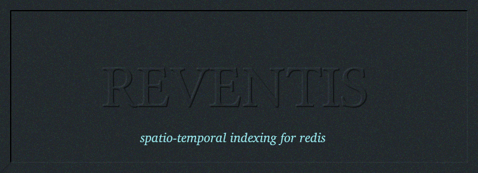

A Redis module for indexing events by location and time for fast efficient
range queries.  Spatial coordinates are given in longitude and latitude with
up to 6 digits of precision. Time is specified by strings - e.g. HH:MM[:SS]
The seconds precision is optional.

## Features

* Store all events in a single Redis native data structure. Use multiple
  data structures with different keys.  

* Efficient range query.  Get all results within a specified range.

* Add/remove categories to individual events.  Include only results
  in a range query that fall in certain specified categories.  Filter
  results by categories of events.

* Purge all that events that fall before a specific time stamp.

* Delete a block of events in a certain range.

* Simple Object tracking feature. Group events by a common object id.
  Track objects by fast efficient access to object histories.  

* Easy to setup and use.  Use any number of language bindings to submit
  commands to the redis server.  Reventis uses a single index to manage
  data.  

## Installation Instructions

To build and install the module:   

```
make .
make all
make install
```

Run `make test` when you have a redis server up and running.  

Installs to /var/local/lib directory.

To load the module into redis, just type in the redis-cli:

```
module load /var/local/lib/reventis.so
module unload reventis
module list

```

Or, put this in your redis.conf configuration file:

```
loadmodule /var/local/lib/reventis.so
```

The latter option is preferable, since it is impossible to simply unload
the module once data is inserted into the database. 


## Module Commands

The following commands are available to interact with the index.  All mostly self-explanatory.
Insert new events with `reventis.insert`  which will reply with a unique event id assigned
for that event.  Using that event id, events can be quickly referenced with the `reventis.lookup`
command or deleted with `reventis.del` command.  `reventis.purge` allows you to delete all events
before the given timestamp.  Or delete a block of events with a given range with `reventis.delblk`.  

```
reventis.insert key longitude latitude date-start time-start date-end time-end title-string
reventis.query key  <longitude range> <latitude range> <time-range>
reventis.lookup key event-id
reventis.delete key event-id
reventis.purge key date time
reventis.delblk key <longitude-range> <latitude-range> <time-range>
reventis.print key
reventis.clear key
reventis.size key
reventis.depth key
```

### Categories

For each event indexed, you can add/remove categories.  Just map your
categories to integer values - from 1 up to 64. (Introduced with v0.2)
Append any number of categories on the end. 

```
reventis.addcategory key event-id category-id ... 
reventis.remcategory key event-id category-id ... 
```

To filter results by category, append category id's on to the end of the query command,
like so:

```
reventis.query key <longitude range> <latitude range> <time-range> <category-id> ...
```

## Object Tracking Commands

By assigning an object id to events, events can be grouped together to provide some basic tracking
features. Call `reventis.update` to add new events with an object id.  This functions just like
insert but for the object id.  `reventis.queryobj` queries for objects within a certain
range and returns the relevant events.  `reventis.trackall` does the same thing except
returns a list of object ids falling within the query range.    

You can then retrieve histories for a given object.  Supply optional date and time limits to
restrict the query to certain time limits.  An entire history of objects can be deleted with
`reventis.delobj`.  For each object, a map is maintained of all the events for that object. This
allows for quick and ready access.  

```
reventis.update key longitude latitude date time  object_id descr
reventis.queryobj key longitude-range latitude-range time-range
reventis.trackall key longitude-range latitude-range time-range
reventis.hist key object_id start-date start-time end-date end-time
reventis.delobj key object_id
```

Examples for how the commands are used can be seen in the test_reventis.cpp file.  The examples are for
c++ but you should be able to do the same in any of the other languages available for redis clients.

### Parameters

The first argument is always the name of the index - e.g. "myevents".  All inserted events belong to
a particular index structure. Multiple structures are possible.

Longitude values must be in the range -180.0 ot 180.0, while acceptable latitudes are -90.0 to 90.0.
Time values are in 24 hour time in the form HH:MM[:SS]. The seconds position is optional. 
Date values are in the form MM:DD:YYYY

The longitude/latitude and time range arguments must include lower and upper bounds.

## Utilities

The load events utility program is available to add new events.  


```
./loadevents key [events|objects|gen] [file|n] 

```

You must specify one of three options: "events", "objects" or "gen".  Both "events" and "objects"
must be followed by the name of a file containing the events and objects.  Examples can be found in
data.csv and objects.csv files.  Each row in data.csv contains a different event definition; each row
in objects.csv contains a different object definition.  Do not switch the two files.

The "gen" option is to randomly generate events and submit them to the redis server.  This must be
by an integer option, n for the number of events to randomly generate. 

The `testreventis` program will test the basic functions of the module. It will run with
ctest, but make sure you have a redis-server running before you invoke it.  


